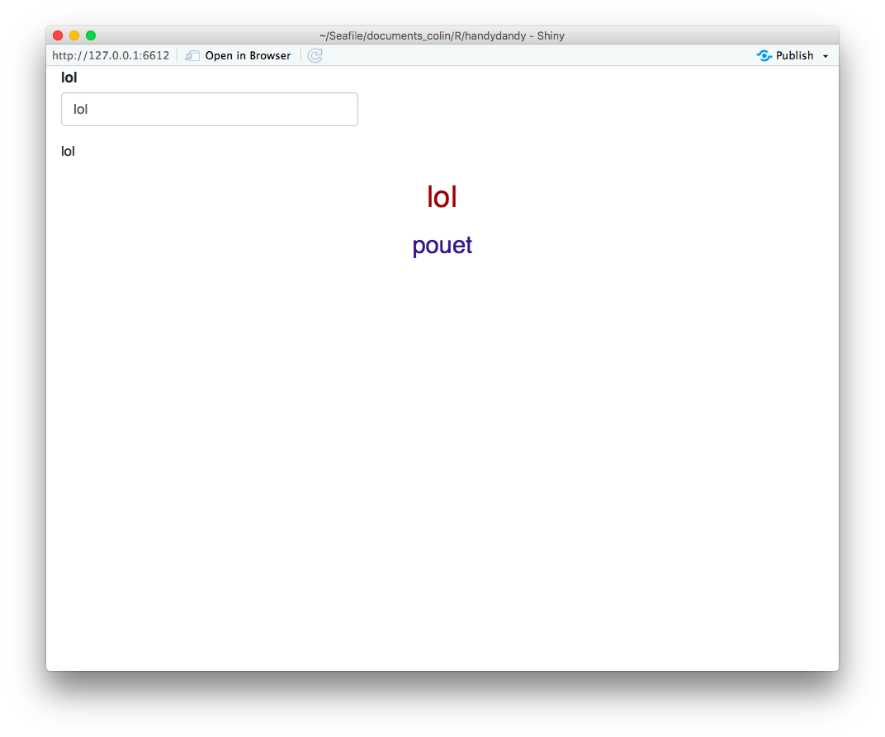

<!-- README.md is generated from README.Rmd. Please edit that file -->

[](https://www.tidyverse.org/lifecycle/#experimental)

# handydandy

The goal of {handydandy} is to provide an easy to use API for bringing
style to a shiny app with CSS.

## Installation

You can install the dev version of {handydandy} with:

``` r
remotes::install_github("ColinFay/handydandy")
```

## Example

### Add and remove css elements

``` r
library(handydandy)

# Create a new dandy
css <- Dandy$new()

# It's easy to add a new style, you need to pass 
# + a selector
# + a list of property = value

css$add_style("body", list("font-family" = "Helvetica",
                         "color" = "#24292e"))
css$add_style("h2", list("font-size" = "3 em",
                       "color" = "#911414",
                       "text-align" = "center"))
css
#> <style type="text/css"> body { font-family: Helvetica; color: #24292e } h2 { font-size: 3 em; color: #911414; text-align: center } </style>

# Easy to update
css$update_style("body","color","#911414")
css
#> <style type="text/css"> body { font-family: Helvetica; color: #911414 } h2 { font-size: 3 em; color: #911414; text-align: center } </style>

# Or to remove one 
css$remove_style("body")
css
#> <style type="text/css"> h2 { font-size: 3 em; color: #911414; text-align: center } </style>

# You can also simply remove one part of your tag
css$remove_style("h2", "color")
css
#> <style type="text/css"> h2 { font-size: 3 em; text-align: center } </style>
```

### In a shiny app

The idea of course is to use it in shiny app:

``` r
css <- Dandy$new()

css$add_style("body", list("font-family" = "Helvetica",
                         "color" = "#24292e"))
css$add_style("h2", list("font-size" = "3 em",
                       "color" = "#911414",
                       "text-align" = "center"))
css$add_style("h3", list("font-size" = "1.5 em",
                       "color" = "#2E2E8F",
                       "text-align" = "center"))


ui <- fluidPage(
  # Give swag to your app
  css$swag(),
  textInput("lol","lol", "lol"),
  textOutput("lolilol"),
  h2("lol"),
  h3("pouet")
)

server <- function(input, output, session) {
  output$lolilol <- renderText({
    input$lol
  })
}

shinyApp(ui, server)
```


